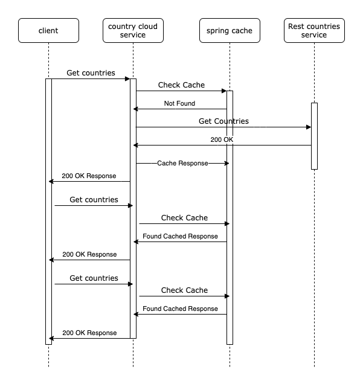

# Country Cloud  
Country cloud is a RESTful web service provides country details, developed using the Spring Boot framework that 
consumes / retrieves the country data from the [Rest countries](https://restcountries.eu/) project.

## What you will need
- [maven >= 3.0](http://maven.apache.org)
- [maven wrapper](https://github.com/takari/maven-wrapper)
- [Java 8](https://adoptopenjdk.net/?variant=openjdk8&jvmVariant=hotspot)

## How you can run 
Run `./mvnw spring-boot:run` to start the project. You could also start the project by running the main class [CountryCloudApplication](src/main/java/com/ini/countrycloud/CountryCloudApplication.java). The application listens to `8080` port by default.

## APIs
Get all the country names and the country code.
```bash
GET /countries
[
   {
      "name":"Afghanistan",
      "country_code":"AF"
   },
   {
      "name":"Åland Islands",
      "country_code":"AX"
   },
   {
      "name":"Albania",
      "country_code":"AL"
   },
   {
      "name":"Algeria",
      "country_code":"DZ"
   },
   {
      "name":"American Samoa",
      "country_code":"AS"
   }....
]
```

Get specific country details by name.
```bash
GET /countries/Finland
{
   "name":"Finland",
   "country_code":"FI",
   "capital":"Helsinki",
   "population":"5491817",
   "flag_file_url":"https://restcountries.eu/data/fin.svg"
}
```

## Caching overview
The web service uses caching offered by the spring boot to avoid calling the external service [Rest countries](https://restcountries.eu/) aggressively. The external service is consumed only when the already retrieved data is expired as 
configured in the [CacheConfiguration](src/main/java/com/ini/countrycloud/CacheConfiguration.java) class. Currently the cached responses are valid for 30 seconds.



## Tests
Run all the tests using `mvn clean verify`.  The tests use a random port to run the spring boot.

The tests cover unit, integration and acceptance scopes.
- [CountryRestControllerTest](src/test/java/com/ini/countrycloud/CountryRestControllerTest.java) - Acceptance test focusing on the REST APIs as called from externally.  
- [CountryServiceCachingTest](src/test/java/com/ini/countrycloud/CountryServiceCachingTest.java) - Unit test focusing on testing the caching using the mocked country service.
- [CountryServiceTest](src/test/java/com/ini/countrycloud/CountryServiceTest.java) - Integration test focusing on testing the service consuming the Rest Countries web service.

## CI / CD
The GitHub actions are used to build and run the tests for the pull requests and commits merged to master. The results are displayed in the README page using the GitHub badges. The workflow artifacts includes the code coverage reports for the future reference.
Refer the latest builds [here](https://github.com/vinoselv/country-cloud/actions).

## Web application
A separate web application developed to consume the REST APIs from country cloud service and hosted in [country-cloud-ui](https://github.com/vinoselv/country-cloud-ui) repository.